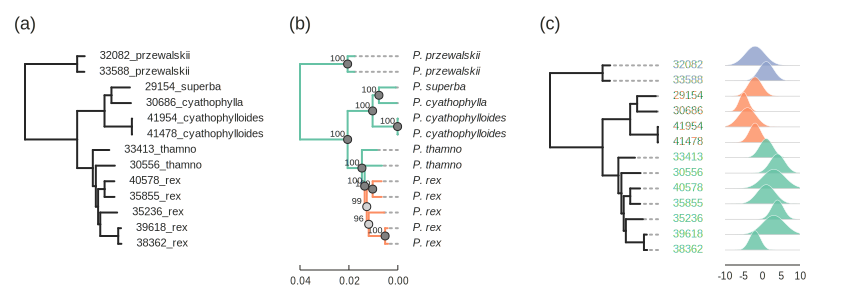

Toytree
==========

Tree plotting with **Toytree** in Python
----------------------------------------
Welcome to toytree, a minimalist tree manipulation and plotting library for use inside jupyter notebooks. Toytree combines a popular tree data structure based on the [ete3](http://etetoolkit.org/docs/latest/tutorial/tutorial_trees.html) library with modern plotting tools based on the [toyplot](http://toyplot.rtfd.io/) plotting library. The goal of toytree is to provide a light-weight Python equivalent to commonly used tree manipulation and plotting libraries in R, and in doing so, to promote further development of phylogenetic methods in Python. Toytree generates rich interactive figures (SVG+HTML+JS) that can be embedded in jupyter-notebooks or webpages, or rendered in SVG, PDF, or PNG for publications. 


Current build status
--------------------

<table><tr><td>All platforms:</td>
    <td>
      <a href="https://dev.azure.com/conda-forge/feedstock-builds/_build/latest?definitionId=9573&branchName=master">
        
      </a>
    </td>
  </tr>
</table>

Current release info
--------------------
| Name | Downloads | Version | Platforms |
| --- | --- | --- | --- |
| [](https://anaconda.org/conda-forge/toytree) | [](https://anaconda.org/conda-forge/toytree) | [](https://anaconda.org/conda-forge/toytree) | [](https://anaconda.org/conda-forge/toytree) |

Installing toytree
-------------------
Toytree can be installed using conda or pip (conda preferred):
```
conda install toytree -c conda-forge
```
It is possible to list all of the versions of `toytree` available on your platform with:
```
conda search toytree --channel conda-forge
```

Documentation
-------------
See the [full documentation](http://toytree.readthedocs.io) to learn more about plotting options, analysis methods, and other features of toytree. You can try out toytree in the cloud before installing by visiting the [toytree binder](http://mybinder.org/repo/eaton-lab/toytree).


Mock Example
------------

```python
# import toyplot and load a newick file from a public URL
import toytree
tre = toytree.tree("https://eaton-lab.org/data/Cyathophora.tre")

# root the tree using a wildcard string matching and draw a tree figure.
rtre = tre.root(wildcard='prz')
rtre.draw(width=400, tip_labels_align=True);

# or chain a few functions together
tre.root(wildcard='prz').drop_tips(wildcard="tham").ladderize().draw();

# extensive styling options are available
rtre.draw(
    tip_labels_colors='pink',
    node_labels='support',
    node_sizes=15,
    node_colors="cyan",
    edge_style={
        "stroke": "darkgrey", 
        "stroke-width": 3,
    },
)
```


