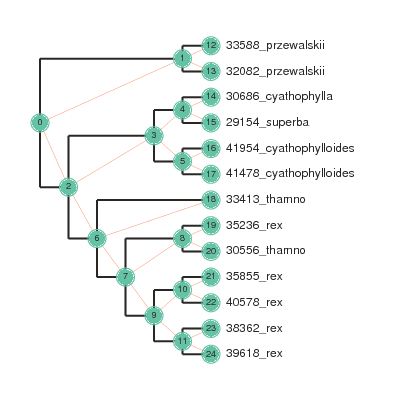
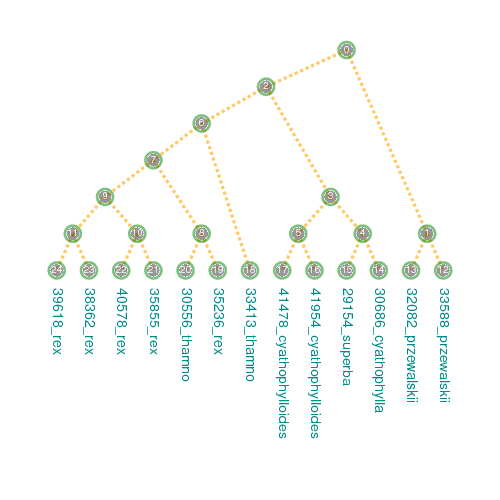

Tree plotting with ``toytree``
-------------------------------
See the [`full documentation`] for more details.

.. code:: python

    import toytree

.. code:: python

    newick = \
    """((33588_przewalskii:100,32082_przewalskii:100)100:100,(33413_thamno:100,
    ((35236_rex:100,30556_thamno:100)82:82,((35855_rex:100,40578_rex:100)100:100,
    (38362_rex:100,39618_rex:100)100:100)73:73)91:91)100:100,
    ((30686_cyathophylla:100,29154_superba:100)100:100,
    (41954_cyathophylloides:100,41478_cyathophylloides:100)100:100)100:100);"""

The ``toytree`` Class object
------------------------------

The help documentation for toytree objects can be accessed with ``?`` or
``<tab>-completion``, which I've printed below. Toytree brings together the
rich tree manipulation library [`ete3`](link) and the rich plotting library
[`toyplot`](link). 

.. code:: python

    tre = toytree.tree(newick)
    tre

.. parsed-literal::

    <toytree.Toytree.Tree at 0x7f8d0c0f1bd0>

Tree plotting basics
---------------------

.. code:: python

    tre.draw(width=400, node_labels=True)

.. image:: https://cdn.rawgit.com/eaton-lab/toytree/master/docs/readme_fig1.svg

Additional styling options
--------------------------

.. code:: python

    tre.draw(
        width=500, 
        height=500,
        
        node_labels=True,
        node_labels_style={"font-size": "10px", 
                           "fill": "white"},
        
        node_size=16,
        node_style={"stroke": "green", 
                    "stroke-width": 2, 
                    "fill": "#333333", 
                    "opacity": 0.5},  
             
        tip_labels=True,
        tip_labels_style={"font-size": "14px", 
                          "-toyplot-anchor-shift": "18px", 
                          "fill": "darkcyan"},
             
        edge_style={"stroke": "orange", 
                    "stroke-opacity": 0.8, 
                    "stroke-dasharray": "3,3",
                    "stroke-width": 3},
             
        use_edge_lengths=False,
        tree_style="c",
        orient="down",
        );

