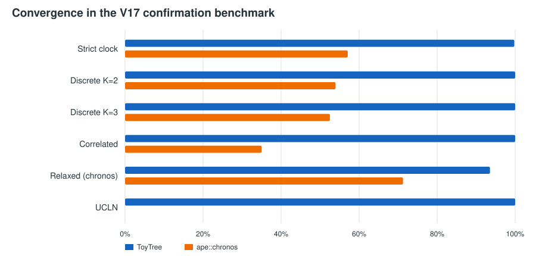
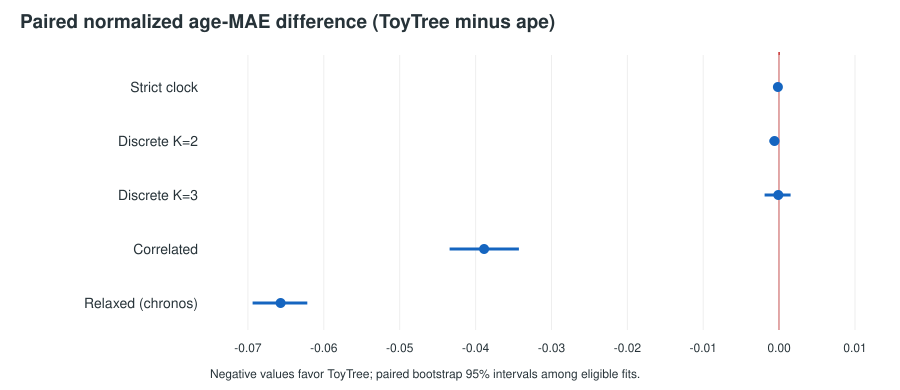

# Final penalized-pseudolikelihood validation report

## Conclusion

Within the prespecified V17 simulation design, ToyTree was more reliable than `ape::chronos` for every shared workflow and was at least as accurate on comparison-eligible paired fits. This is a scoped simulation result, not a claim of universal superiority. It supports release of ToyTree's strict clock, explicit-category discrete model, and fixed-lambda correlated model; `relaxed` is retained for chronos compatibility. ToyTree additionally offers the validated fixed-lambda UCLN model, recommended for new continuous uncorrelated-rate analyses.

No speed claim is made. Accuracy jobs ran concurrently, and the timing pilot was neither large enough nor a controlled confirmation benchmark.

| Model | ToyTree converged | ape converged | Paired age-MAE difference (95% interval) |
|---|---:|---:|---:|
| Strict clock | 0.998 | 0.571 | -0.0002 [-0.0004, -0.0000] |
| Discrete K=2 | 1.000 | 0.540 | -0.0006 [-0.0013, -0.0001] |
| Discrete K=3 | 1.000 | 0.525 | -0.0001 [-0.0019, 0.0015] |
| Correlated | 1.000 | 0.350 | -0.0389 [-0.0434, -0.0343] |
| Relaxed (chronos) | 0.935 | 0.713 | -0.0657 [-0.0694, -0.0622] |
| UCLN | 1.000 | — | — |

Negative paired differences favor ToyTree. Accuracy summaries exclude nonconverged or calibration-invalid fits; convergence is therefore reported alongside accuracy. Full values are in [table-model-comparison.csv](table-model-comparison.csv).

## What is comparable

Strict clock, discrete K=2/K=3, and relaxed implement the corresponding chronos objectives. Correlated expresses the same biological idea but is not objective-identical: ToyTree smooths adjacent log rates and connects basal branches through a profiled root log rate. UCLN has no chronos counterpart here. The [scope table](table-release-scope.csv) records these distinctions.

The confirmation contained 2880 dataset-engine scenarios and 5280 fit tasks. ToyTree convergence was 0.998 for clock, 1.000 for correlated and both discrete settings, 0.935 for relaxed, and 1.000 for UCLN. Corresponding ape convergence was 0.571, 0.350, 0.540, 0.525, and 0.713. A production-budget replay resolved 31 relaxed failures but left 1 strict-clock fit nonconverged; the common-budget confirmation is the primary fair comparison.

## Accuracy interpretation

Among comparison-eligible pairs, ToyTree had lower normalized age MAE for clock, discrete K=2, correlated, and relaxed. Discrete K=3 was statistically indistinguishable because its interval crossed zero. The largest gain was for relaxed, although the engines can occupy different basins under its unusual Gamma-CDF convention. These simulations do not address topology error, calibration misspecification, heterochronous tips, or propagation of branch-length estimation uncertainty.

## Lambda decision

Automatic lambda estimation is not in the final API. In V18, correlated per-tree CV selected a grid boundary in 23.4% of datasets; median supported chronogram spread was 0.140 and its 90th percentile was 0.459. UCLN recovery was better, but boundary selection still occurred in 28.1% and its spread 90th percentile was 0.103. This does not justify a general point estimator from one tree. Users must supply lambda and report sensitivity across scientifically plausible values.

## Reproducibility

This report is generated deterministically by [generate_report.py](generate_report.py); [manifest.json](manifest.json) hashes all inputs and outputs. Historical runners and rejected algorithms are recoverable from the pinned [archive manifest](../archive/README.md). The oversized V18 result lives only in Git history, with exact recovery metadata in its compact summary.
